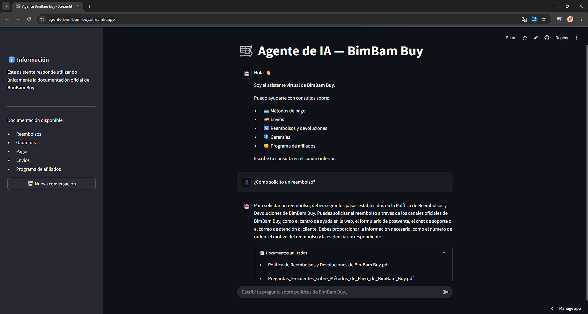

# 🛒 BimBam Buy — Agente de IA Corporativo

## Descripción general

BimBam Buy es un agente conversacional desarrollado con técnicas de Retrieval-Augmented Generation (RAG), diseñado para responder consultas sobre la documentación oficial de la empresa.

El agente permite a los usuarios obtener respuestas relacionadas con políticas de reembolsos, garantías, métodos de pago, envíos y programa de afiliados, utilizando exclusivamente la información contenida en los documentos PDF proporcionados. De esta manera, se reducen las respuestas incorrectas y se garantiza que la información entregada provenga únicamente de fuentes oficiales.

La aplicación cuenta con una interfaz desarrollada en Streamlit y utiliza un modelo de lenguaje de Groq para generar respuestas en lenguaje natural.

---

# Arquitectura de la solución

El funcionamiento del agente sigue el siguiente flujo:

1. **Carga de documentos**
   - Se cargan los documentos PDF mediante `PyPDFLoader`.

2. **Preprocesamiento**
   - Los documentos se dividen en fragmentos (chunks) utilizando `RecursiveCharacterTextSplitter`.

3. **Generación de embeddings**
   - Cada fragmento se convierte en un vector utilizando el modelo:
     ```
     intfloat/multilingual-e5-small
     ```

4. **Almacenamiento vectorial**
   - Los embeddings se almacenan en un índice FAISS para realizar búsquedas semánticas.

5. **Recuperación de contexto**
   - Cuando el usuario realiza una pregunta, se recuperan los fragmentos más relevantes mediante búsqueda por similitud.

6. **Generación de respuesta**
   - Los fragmentos recuperados se envían junto con la pregunta al modelo Llama 3.3 70B de Groq mediante un prompt que restringe las respuestas al contexto recuperado.

7. **Interfaz**
   - La respuesta y los documentos utilizados se muestran al usuario mediante una aplicación desarrollada con Streamlit.

---

# Tecnologías y herramientas utilizadas

- Python 3.12
- LangChain
- Groq
- Llama 3.3 70B Versatile
- HuggingFace Embeddings
- FAISS
- Streamlit
- Pydantic
- python-dotenv

---

# Estructura del proyecto

```
bimbam_agente/
│
├── app/
│   ├── main.py
│   ├── cadena.py
│   └── ingesta.py
│
├── documentos/
│   ├── *.pdf
│
├── indice_faiss/
│   ├── index.faiss
│   └── index.pkl
│
├── requirements.txt
├── README.md
└── .env
```

---

# Diseño de la solución

Durante el desarrollo del agente se tomaron las siguientes decisiones de diseño para mejorar la precisión de las respuestas:

### Chunking de documentos

Los documentos PDF se dividen en fragmentos utilizando `RecursiveCharacterTextSplitter` con solapamiento (`chunk_overlap`), lo que evita perder contexto cuando una sección continúa en el siguiente fragmento.

### Embeddings semánticos

Se utilizó el modelo `intfloat/multilingual-e5-small`, especializado en búsqueda semántica multilingüe, permitiendo recuperar información relevante incluso cuando la pregunta del usuario no coincide exactamente con el texto del documento.

### Recuperación mediante FAISS

Los embeddings se almacenan en un índice FAISS, permitiendo realizar búsquedas por similitud de manera eficiente sobre todos los documentos.

### Priorización de fragmentos

Una vez recuperados los fragmentos más similares, estos se agrupan por documento y se calcula una puntuación de evidencia considerando los tres fragmentos con mayor similitud de cada documento. Esto permite priorizar los documentos que contienen mayor cantidad de información relevante antes de construir el contexto enviado al modelo de lenguaje.

### Generación estructurada

Las respuestas del modelo se validan mediante `PydanticOutputParser`, garantizando que el resultado siempre tenga la estructura:

- respuesta
- fuentes

Esto evita errores de formato y facilita el consumo de la información por parte de la interfaz.

# Instrucciones para ejecutar el proyecto

## 1. Clonar el repositorio

```bash
git clone https://github.com/alexandradela2909/agente-bim-bam-buy.git
cd agente-bim-bam-buy
```

## 2. Crear un entorno virtual

Windows:

```bash
python -m venv .venv
```

Activar:

```bash
.venv\Scripts\activate
```

## 3. Instalar dependencias

```bash
pip install -r requirements.txt
```

## 4. Configurar variables de entorno

Crear un archivo `.env` con el siguiente contenido:

```env
GROQ_API_KEY=TU_API_KEY
```

## 5. Ejecutar la aplicación

```bash
streamlit run app/main.py
```

La aplicación estará disponible en:

```
http://localhost:8501
```

> **Nota:** El repositorio ya incluye el índice FAISS (`indice_faiss`), por lo que no es necesario ejecutar `ingesta.py`. Solo debe ejecutarse si se agregan o modifican los documentos PDF.

---

# Ejemplos de preguntas que el agente puede responder

- ¿Cómo solicito un reembolso?
- ¿Cuál es el plazo para devolver un producto?
- ¿Qué métodos de pago acepta BimBam Buy?
- ¿Qué cubre la garantía de los productos?
- ¿Cómo funciona el programa de afiliados?
- ¿Qué sucede si mi pedido llega incompleto?
- ¿Cuánto demora un reembolso?
- ¿Qué documentos debo presentar para solicitar una garantía?

---

# Ejemplos de respuestas generadas por el agente

### Pregunta

> ¿Cómo solicito un reembolso?

### Respuesta

> Para solicitar un reembolso, debes seguir los pasos establecidos en la Política de Reembolsos y Devoluciones de BimBam Buy. Puedes solicitar el reembolso a través de los canales oficiales de BimBam Buy, como el centro de ayuda en la web, el formulario de postventa, el chat de soporte o el correo de atención al cliente. Debes proporcionar la información necesaria, como el número de orden, el motivo del reembolso y la evidencia correspondiente.

**Fuentes**

- Política de Reembolsos y Devoluciones de BimBam Buy.pdf
- Preguntas Frecuentes sobre Métodos de Pago de BimBam Buy.pdf

---

### Pregunta

> ¿Qué métodos de pago aceptan?

### Respuesta

> BimBam Buy puede aceptar, según país y configuración operativa: Tarjeta de crédito, Tarjeta de débito, Transferencia bancaria, Pago en efectivo en puntos habilitados, Billeteras digitales disponibles por país, Cuotas o financiamiento, cuando aplique.

**Fuentes**

- Preguntas Frecuentes sobre Métodos de Pago de BimBam Buy.pdf

---

# Despliegue

La aplicación fue desplegada utilizando Streamlit Community Cloud.

## Enlace

[https://agente-bim-bam-buy.streamlit.app/](https://agente-bim-bam-buy.streamlit.app/)

## Demostración

[](https://drive.google.com/file/d/168E2sEvmOhIV_YSHSQVBG8w6BhmhBkwo/view?usp=sharing)
